<h1 align="center">Hi, I'm Iheb Mahfoudh.</h1>

  <strong>Cybersecurity Engineer · Penetration Tester · CTF Player</strong> 
  Based in Tunisia 🇹🇳 · Online as <strong>ZuresTN</strong>

  
  

---

## About me

I focus on offensive security: understanding how systems fail, tracing attack paths, and using those findings to help make systems stronger. My interests span web and network security, Active Directory, privilege escalation, and reverse engineering.

CTFs and Hack The Box are part of my hands-on practice, alongside exploring bug bounty hunting and malware analysis.

<!-- Regenerate the terminal assets with: python scripts/build-terminal.py -->
<picture>
  <source media="(max-width: 600px) and (prefers-reduced-motion: reduce)" srcset="assets/terminal-mobile-static.svg" />
  <source media="(prefers-reduced-motion: reduce)" srcset="assets/terminal-static.svg" />
  <source media="(max-width: 600px)" srcset="assets/terminal-mobile.svg" />
  
</picture>

## Toolkit

| Area | Tools & technologies |
| :--- | :--- |
| Web & network testing | Burp Suite · Nmap · Wireshark · Metasploit |
| Active Directory & password auditing | BloodHound · Hashcat |
| Reverse engineering | Ghidra |
| Programming & scripting | Python · Bash · C · JavaScript · Java |
| Systems & infrastructure | Kali Linux · Linux · Docker · Git · MySQL · AWS |

## Hack The Box

I use Hack The Box to practice enumeration, exploitation, and privilege escalation in lab environments.

  

  <a href="https://app.hackthebox.com/users/2246031">View my profile and current ranking →</a>

  
<strong>Contribution activity</strong>

   
  <picture>
    <source media="(prefers-color-scheme: dark)" srcset="https://raw.githubusercontent.com/ZuresTN/ZuresTN/output/github-snake-dark.svg" />
    <source media="(prefers-color-scheme: light)" srcset="https://raw.githubusercontent.com/ZuresTN/ZuresTN/output/github-snake.svg" />
    
  </picture>

  Generated daily by the contribution-snake workflow in this repository.

## Let's connect

For security discussions, CTF collaboration, or project inquiries:

**[zures001@gmail.com](mailto:zures001@gmail.com)** · **[Hack The Box](https://app.hackthebox.com/users/2246031)**

---

Curiosity drives the work. Permission defines the scope.

